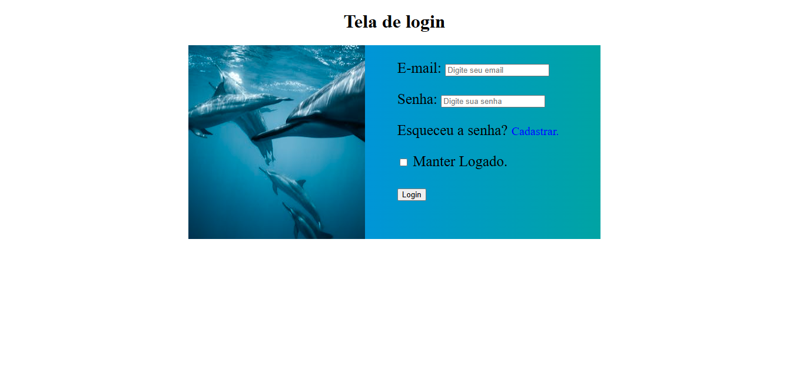

**Descrição:**

Este projeto consiste em uma simples página HTML com uma tela de login básica, estilizada com CSS. 

**Funcionalidades:**

* **Campos de entrada:** Permite ao usuário inserir e-mail e senha.
* **Botão de login:** Simula o envio das credenciais de login.
* **Link para recuperação de senha:** Fornece um link para a página de recuperação de senha (não implementado neste exemplo).
* **Checkbox "Manter Logado":** Permite ao usuário optar por manter a sessão ativa.
* **Responsividade:** A tela de login se adapta a diferentes tamanhos de tela, incluindo dispositivos móveis.

**Tecnologias Utilizadas:**

* HTML
* CSS

**Estrutura de Arquivos:**

* `index.html`: Arquivo HTML principal contendo a estrutura da página.
* `style.css`: Arquivo CSS responsável pelo estilo visual da página.
* `imagens/golfinho.jpg`: Imagem utilizada na tela de login.
